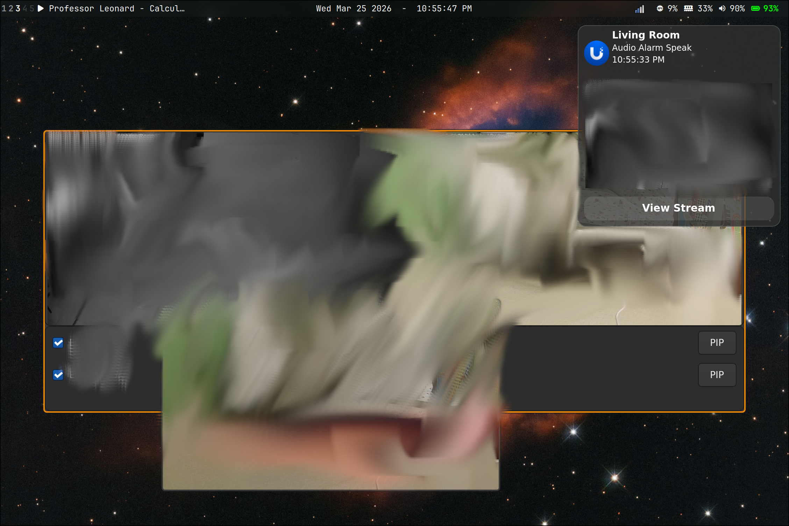

# UniFi Cams

Live camera dashboard and motion notification system for UniFi Protect on Linux.

  

## Features

- **Camera Dashboard** — GTK4 + GStreamer GUI with GPU-accelerated live RTSPS streams. Toggle cameras on/off, launch PIP windows, all from one panel.
- **Motion Notifications** — Webhook server receives UniFi Protect events and sends desktop notifications with camera thumbnails. Click to open a live PIP stream. Supports any event type available in the Protect controller (motion, person, vehicle, package, etc.).
- **PIP Streams** — Floating picture-in-picture windows via mpv, launchable from the dashboard or notifications.

## Screenshots



## Setup

### Dependencies

- **Python 3.10+**
- **mpv** — PIP streams and notification sounds
- **ffmpeg** — RTSPS stream bridging for the dashboard
- **libnotify** (`notify-send`) — desktop notifications
- **GTK4 + PyGObject + GStreamer** — dashboard GUI (provided automatically by `unifi-dashboard.sh` on NixOS)
- A notification daemon (**SwayNC**, **mako**, **dunst**, etc.)

On Arch:

```sh
sudo pacman -S mpv ffmpeg libnotify
```

On Ubuntu / Debian:

```sh
sudo apt install mpv ffmpeg libnotify-bin
```

On Fedora:

```sh
sudo dnf install mpv ffmpeg libnotify
```

On NixOS, the dashboard shell script handles GTK4/GStreamer deps via `nix-shell`. mpv and libnotify are likely already available if you run Hyprland/Sway.

> **Note:** The notification listener requires a Linux desktop with a notification daemon (SwayNC, mako, dunst, etc.). The dashboard requires a Wayland or X11 session with GTK4. macOS and Windows are not supported.

### Configuration

1. Copy the example config files:

   ```sh
   cp .env.example .env
   cp cameras.example.json cameras.json
   ```

2. Fill in your `.env`:

   | Variable | Description | Default |
   |---|---|---|
   | `UNIFI_TOKEN` | Bearer token matching your Protect webhook config | *(required)* |
   | `UNIFI_HOST` | IP of your Protect console (Cloud Key, UNVR, UDM, etc.) | *(required)* |
   | `UNIFI_LISTEN_PORT` | Port for the webhook listener | `9999` |
   | `UNIFI_COOLDOWN` | Seconds between repeat notifications per camera | `30` |
   | `UNIFI_SNOOZE_MINS` | Minutes to snooze a camera from the notification button | `30` |
   | `UNIFI_SOUND` | Path to a custom notification sound | `assets/notification_sound.mp3` |
   | `UNIFI_SOUND_ENABLED` | Set to `0`, `false`, or `no` to disable notification sounds | `1` (enabled) |

3. Add your cameras to `cameras.json` (keys are MAC addresses, uppercase, no colons):

   ```json
   {
     "AABBCCDDEEFF": {
       "name": "Front Door",
       "stream": "rtsps://192.168.1.1:7441/your-stream-token?enableSrtp"
     }
   }
   ```

   Find camera info in the Protect UI:
   - **MAC address**: Camera → Settings → General (format: `AABBCCDDEEFF`, uppercase, no colons)
   - **RTSP stream URL**: Camera → Settings → Advanced → RTSP

4. Configure the webhook in UniFi Protect:
   - Settings → Notifications → Webhooks
   - Point to `http://<your-ip>:9999` with the same bearer token from `.env`

## Usage

### Camera Dashboard

```sh
./unifi-dashboard.sh
```

Opens the GTK4 dashboard. Use the checkboxes to toggle live streams and the PIP buttons to pop out floating mpv windows.

### Motion Notifications

```sh
set -a && source .env && set +a
python3 unifi-notify.py
```

Listens for webhook events from UniFi Protect. Sends desktop notifications with thumbnails on motion. Click **View Stream** to open a live PIP window.

### Standalone PIP Stream

```sh
./unifi-stream.sh 'rtsps://192.168.1.1:7441/your-stream-token?enableSrtp'
```

Opens a single camera in a floating mpv window.

## Architecture

```
unifi-dashboard.py    GTK4 + GStreamer live viewer (ffmpeg → fdsrc → decodebin → gtk4paintablesink)
unifi-notify.py       Webhook server (stdlib http.server) → notify-send → mpv PIP
unifi-stream.sh       Standalone mpv PIP launcher
unifi-dashboard.sh    nix-shell wrapper providing GTK4/GStreamer/PyGObject deps
```

Both components read camera config from `.env`. Thumbnails are cached in `/tmp/unifi-cams/` and shared between the dashboard and notification system.
